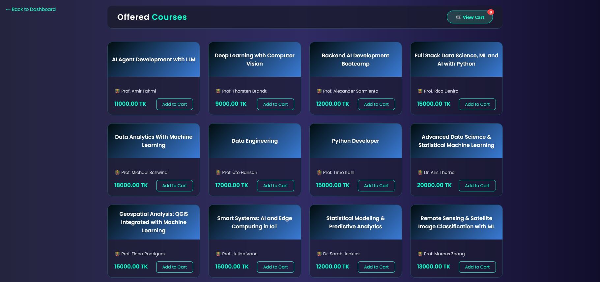
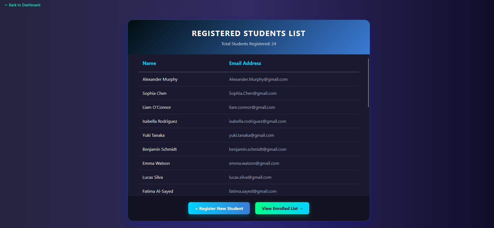
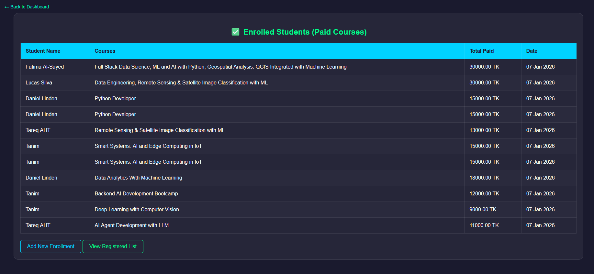
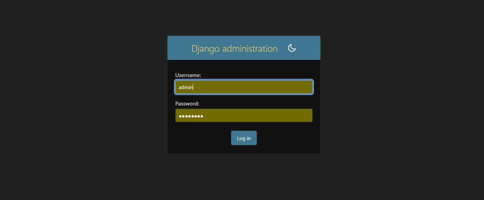

# 🎓 Edu-Connect: Student Management & Information System
**Edu-Connect** is a modern **Django-based** web application designed to digitize and automate the student registration and course enrollment process. The project features a premium dark-themed UI, smart cart functionality, and integrated data management using SQLite.

---

### Features
* **Central Dashboard**: A unified portal to navigate between all modules like Registration, Courses, and Lists.
* **Student Registration**: Modern registration form with name, email, and password validation.
* **Offered Courses**: Interactive course grid layout with a smart "Add to Cart" system.
* **Real-time Cart Counter**: Visual feedback that updates the cart count immediately upon selection.
* **Secure Checkout**: Professional checkout modal including payment method selection (bKash, Nagad, Card) and name verification.
* **Enrolled Students List**: An automated record of students who have completed purchases, including payment details and dates.
* **Responsive UI**: Fully optimized design for Desktop, Tablet, and Mobile devices.

---

### Tech Stack
* **Backend**: Django (Python)
* **Frontend**: HTML5, CSS3 
* **Database**: SQLite (Default Django setup)
* **Tools**: Django Admin, Django Shell, DB Browser for SQLite

---

### Project Structure

```text

student_management/

├── manage.py
├── db.sqlite3
├── student_management/ (Project Config)
│   ├── settings.py
│   └── urls.py
├── students/ (Main App)
│   ├── models.py
│   ├── views.py
│   ├── templates/
│   │   └── students/
│   │       ├── index.html
│   │       ├── register.html
│   │       ├── enrollment.html
│   │       └── enrolled_list.html
│   └── migrations/
└── screenshots/ (Project Images)


### 📸 Project Screenshots








